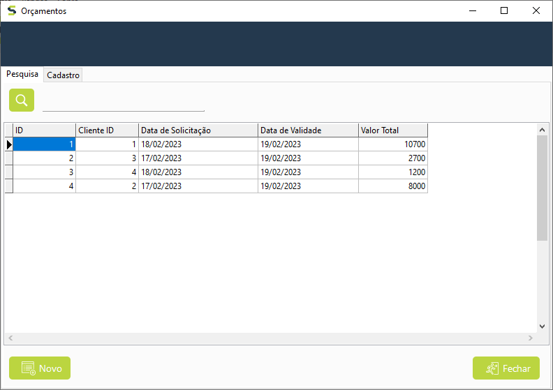

<h1 align="center">
    
    <br>
    Sistema de Controle de Orçamento para Empresas
</h1>


<div align="center">
    
    
    
    
</div>

<div align="center">
    <br>
    
</div>
<br>

# :page_with_curl: Description
<p>
A fim de elaborar o projeto de conclusão de curso, foi requisitado pelo professor do <a target="_blank" href="https://www.softwarebymaringa.com.br/realizacao/235/saber_ti.html">Saber TI</a> (programa desenvolvido pela empresa <a target="_blank" href="https://accion.com.br/">Accion Sistemas</a> em parceria com a associação Software By Maringá (SBM) e com apoio do Centro Tecnológico de Maringá – SENAI) o desenvolvimento de um sistema para gestão e controle de orçamentos.
	O SCOPE (Sistema de Controle de Orçamentos para Empresas) tem como finalidade gerar e controlar os orçamentos de produtos solicitados pelos clientes de uma instituição. 
</p>

# :game_die: Features
- [x] Controle de Acesso
- [x] Cadastro de Usuários
- [x] Cadastro de Categorias
- [x] Cadastro de Produtos
- [x] Cadastro de Clientes
- [x] Cadastro de Orçamentos
- [x] Gerar Relatórios 

# :gear: Application settings
## Database
> O arquivo SQL pode ser encontrado em: [src/banco/scope.sql](https://github.com/Gustavohps10/scope-lazarus/blob/main/src/banco/scope.sql)

## scope.ini file
> ⚠️ Renomeie o arquivo "scope-sample.ini" para "scope.ini" e configure o banco de dados
```bash
; SCOPE Settings

[DB]
DB_HOSTNAME = localhost
DB_DATABASE = postgres
DB_USER     = postgres
DB_PASSWORD = 1234
DB_PORT     = 5432
DB_PROTOCOL = postgresql
DB_LIBRARY_LOCATION =
```

# :hammer_and_wrench: Technologies
- [Lazarus](https://www.lazarus-ide.org/)
- [ZeosLib](https://zeoslib.sourceforge.io/)
- [PostgreSQL](https://www.postgresql.org/)
- [BGRAControls](https://github.com/bgrabitmap/bgracontrols/)
- [Laz Report](https://wiki.freepascal.org/LazReport_Tutorial)
- [Dbeaver](https://dbeaver.io/)

# :adult: Author
Made with 💜 Gustavo Henrique
